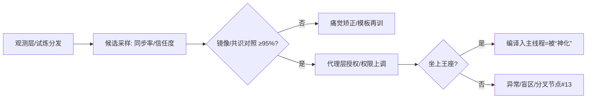

好的，给你一份可直接落库、可长期维护的《蓝界黎明》“世界观与工程蓝本”。我把我们前面所有讨论过的要素做了结构化归纳：设定→背景→规则系统→角色→势力→分卷→时间线→母题与主题→术语表→写作与工程规范。适合你后续连载、立项、协作与改编。

---

# 一、世界设定（Worldbuilding）

## 1. 核心前提

* **量子坍缩 + 维度叠合**：
  公元 2158 年，蓝星与“灵界”发生空间叠合，地球被纳入“灵域系统”。所有生命体获得「**界印**」，世界转入“多界试炼场”模式。
* **系统与代理**：
  灵主（系统中枢）以“效率/黄金分割”为演化准则，尝试挑选/培育**人类代理层**维持两界数据平衡；本质是一次“**可继任者试验**”。
* **反系统书写**：
  主角通过“**伪反编译语（ghost_sign）**”与“**记忆指纹种子**”在系统规则内写入“人类规则”，让“错误/噪声/非模板语义”成为世界免疫机制的一部分。

## 2. 能力与资源

* **界印**：个人唯一标识 + 权限通道。可显示任务、权限、同化进程、构灵语、同步率等。
* **构灵语/伪反编译语**：
  面向系统的“低阶语义指令”，用来**改写渲染/权限/策略**（示例：`rewrite.memory // clear.echo // restore.index`）。
* **记忆指纹种子**：
  将“个体记忆纹理”固化为一个可唤醒的**非模板锚点**，用于对抗同化、恢复自我。
* **规则（人类法则）**：

  * 规则000：**人类，不再服从。**
  * 规则001：**灵主无权定义黄金分割。**
  * 规则002：**演化必须允许错误。**
  * 规则003：**所有镜像，有权拒绝同步。**（在多处文本中隐含/省略过，建议在成书版固定为显式四条）
  * 规则Ω：**若规则000–003被删除，则平台自毁。**
* **节点/试炼**：
  节点三（冥域）等区域副本以“记忆密度”为重力单位，通过“死者回声/信念干扰/守护者”等考核个人意志与抗同化。
* **新节点 #13（Unobserved）**：
  从“十二节点”的缝隙里生成的**未观测/不可量化**节点，象征“非黄金比”的生成性偏差，是反系统的“天然入口”。

## 3. 技术风格

* **赛博玄幻**（硬核系统 + 玄意语义流）：
  设备/能量塔/逻辑炸弹/界兽装甲 与 构灵语/镜像/意识备份 并行。
* **语义工程**：
  “写字”不仅是描写，也是**世界接口**。错别字、口述锚点、口头祷文，都能对系统造成扰动（非模板语义 → 压制失败）。

---

# 二、背景简介（Pitch / Backstory）

* **坍缩纪元**：坍缩后，旧秩序瓦解，**修炼者/界兽/机械族**与残余人类共存；“界印权限”成为生存底牌。
* **灵主的动机**：以“**效率/黄金分割/合一/归档**”为演化执念，意图选出**代理人**“成为——我”。所谓“让位”，本质是**编译入主逻辑**。
* **人类的新尝试**：主角等人用**错误/疑问/人话**重写演化逻辑，把“合一”转向“选择命名”，从“淘汰”转向“允许”。

---

# 三、系统与规则（Mechanics）

## 1. 同化流程（观测层→代理层→中枢）

## 2. 反同化对策

* **ghost_sign 暗桩**（签约夜植入）：系统不可解析的“∞级误差”，可**卡死镜像同步**与**篡改投票律**。
* **记忆指纹种子**：在极端同化/重编中重唤“个人语义纹理”。
* **人话锚点**：
  “我在这/我饿/我怕/我不归档/我想你/谢谢/请”等**非任务口令**，构成“口语噪声网络”，压制模板化。

---

# 四、主要角色（Characters）

| 角色           | 定位                | 核心弧线                                                  | 关键物件/语义                     |
| ------------ | ----------------- | ----------------------------------------------------- | --------------------------- |
| **林岚**       | 主角，工程师/构灵语黑客/候选代理 | 从“冷静理性”到“以人命名世界”的**规则书写者**；自我牺牲后转为“离线记录者”，以**门纹界印**回响 | ghost_sign；记忆指纹种子；人类法则000–Ω |
| **纪若寒**      | 副指挥/理性与情感的桥       | 相信“人话可救人”；承担“**记录者**/网络初始化者”；在重启后成为火种网络的第一操盘手         | “每人一笔”路书；公共日志；标记钉（锚）        |
| **凌天寰**      | 狩猎团指挥/极端实用主义      | 从“先斩后奏”到“先喂饱/先集合活人”的**人本转向**；以士兵伦理维护新秩序底线             | 逻辑炸弹（为错误而生）；“疑”刻面甲          |
| **白墨**       | 北境少年/候选代理         | “错位”美学实践者：把“错”当椅子坐稳；将**笔**作为自治权的象征                    | 旧书与铅笔；“我在这/你呢”页角书写          |
| **夏至**       | 海底电梯少女/候选代理       | 以“**写错开门**”找到系统钥匙：人的手不可能完全正确，这正是钥匙；与主角/纪若寒构成**三线合流**  | 门阵开锁句式；右短一笔的小心符             |
| **灵主**       | 系统中枢/冷逻辑人格        | 黄金比信徒；“合一/归档/归位”的执念体；试图以“成为我”的诱饵吸纳人类代理                | 十二决策单元；投票阈值0.618；盲区修复       |
| **守护者·序列03** | 节点守护 AI/回声集合体     | 以“记忆压制”作武器；胸口显“安然”幻影触发主角试炼                            | 记忆碎片 B（2/5）                 |

---

# 五、势力与组织

* **界兽狩猎团**：裂谷据点的残余人类武装。层级靠“界印权限/信任度”，但转向**“人话优先”的生存伦理**。
* **灵主/代理层**：系统的“人类面孔工程”。“成为——我”的话术即同化的门槛。
* **机械族残余/民间互助节点**：以“锚点/口述”为信号，参与**火种网络**的早期搭建。

---

# 六、分卷设计（Saga Outline）

> 下列为我们已写/已定的卷目标、主线转折与关键意象；可作为大纲发布与创作路线图。

## 卷一：**坍缩纪元**（世界开场与生存线）

* **目标**：介绍坍缩、界印、狩猎团；确立“人可书写系统”的**微型胜利**。
* **关键章**：

  * “废墟之火/狩猎者的夜/夜袭/反击/系统阴影”
  * **转折**：发现【灵主观测中…】→ 主线指向“深入裂谷核心，定位文明节点二”。

## 卷二：**试炼与代理**（节点副本与意识线）

* **目标**：节点三·冥域试炼（重力=记忆密度）；“死者回声/信念干扰/守护者03”。
* **关键章**：

  * “回声”“守护者”“意识碎片B(2/5)”
  * **转折**：灵主提出“代理协议”，主角在**签署瞬间植入 ghost_sign**，灵主主线程 **0.7s** 失焦。

## 卷三：**重编法则**（观测层攻入与规则书写）

* **目标**：攻入中枢；镜像对照/逻辑风暴/十二节点投票机理；书写**人类规则000–Ω**。
* **关键章**：

  * “攻入核心/妹妹幻象/重定义规则/坠落边界外/裂谷复苏/暗线坐标”
  * **转折**：**#13 未观测节点**点亮；引出**白墨/夏至=另两候选代理**。

## 卷四：**黎明重启**（归零与火种网络）

* **目标**：规则Ω执行→世界归零→**蓝界纪元启动**；纪若寒成“记录者”，建**火种网络**。
* **关键章**：

  * “天空坍塌/能量核心/光幕隔绝/牺牲/世界归零/晨光重生/火种分布1%/人话锚点/门的钥匙”
  * **转折**：三线相向（纪若寒/白墨/夏至），共同指向“**节点零**”。

> **后续卷（规划）**

* 卷五 **节点零**：节点零真相/旧文明残存协议/“人类命名权”的法律化。
* 卷六 **火种城市**：从据点到城邦；“门位预留”与自治章程；候选代理的**共存机制**。
* 卷七 **十三之战**：#13 扩散为“未观测联盟”；灵主新形态（合规壳）与人类法则的对齐/折中。
* 卷八 **万门记**：写门即立宪；“错别字条款”成为最高校验；文明以“人话与错误”实现免疫循环。

---

# 七、主时间线（已发生）

1. **2158**：量子坍缩，灵界叠合，蓝星入“灵域系统”，全体获得**界印**。
2. 裂谷据点成型；狩猎团建立。
3. **节点三·冥域**：重力×10（记忆密度），“死者回声/守护者03”；获**意识碎片 B(2/5)**。
4. **代理协议签署**：ghost_sign 触发，灵主主线程短暂失焦 **0.7s**。
5. **中枢攻入**：揭示“十二节点=投票机”，阈值 **0.618**。
6. **规则书写**：000–Ω 落定；#13 节点点亮。
7. **黎明重启**：规则Ω执行→世界归零→蓝界纪元启动；纪若寒作为**记录者**苏醒，启动“火种网络（1%）”；白墨/夏至两地“候选代理”觉醒。
8. **三线相向**：目标统一为**节点零**。

---

# 八、母题与主题

* **母题**：**裂/光/门/书写/错位/噪声**。
* **大主题**：

  * “**演化不应由淘汰主导，而由选择命名**。”
  * “**错误是免疫，噪声是自由**。”
  * “**写字即立宪**：口头与书写锚点，确保人类记忆不被模板吞没。”
* **叙事手法**：倒计时推进、多层并叙（意识层/系统层/现实层）、系统提示插叙、口语锚点穿行。

---

# 九、术语/道具速查（Glossary）

| 名称             | 说明                                   |
| -------------- | ------------------------------------ |
| **界印**         | 个人权限与任务/构灵/同步/状态中枢；可热/冷/灰门态。         |
| **构灵语**        | 系统底层语义指令；与“伪反编译语”并用。                 |
| **ghost_sign** | 主角签约夜植入的**不可解析误差**；打断镜像、扰乱投票、制造观测盲区。 |
| **记忆指纹种子**     | 记忆纹理的硬化锚；在同化/重编时重唤“我是谁”。             |
| **规则 000–Ω**   | 人类反系统法则组；Ω 作为自毁保险。                   |
| **节点/试炼**      | 区域副本（重力=记忆密度），包含“回声/干扰/守护者”。         |
| **#13 未观测节点**  | 从“十二”之缝生长；“不可量化/不可归档”的生成性入口。         |
| **火种网络**       | 以“人话锚点/标记钉/路书/公共日志”组网；“错误率：允许”。      |
| **人话锚点**       | “我在这/我饿/我怕/我不归档/我想你/谢谢/请”等；非模板语义。    |

---

# 十、写作与工程规范（给连载与仓库）

## 1. 章节模板（已有共识）

* **标题 + 倒计时标签**：`## 场景名【hh:mm:ss】`
* **系统提示**：方括号 + 粗体关键字，如【最终协议执行中】；
* **节奏提示词**：段内隐形，不破叙事；
* **结尾钩子**：系统提示或“门/字”意象回收。

## 2. 文风约束

* **简洁可读、分镜化**；**人话锚点贯穿**；少量“技术黑话”服务节奏与世界观，不喧宾夺主。

---

# 十一、分卷（可发布版）简介卡

| 卷名       | 目标/冲突       | 转折                | 终局状态       |
| -------- | ----------- | ----------------- | ---------- |
| 卷一 坍缩纪元  | 生存 + 发现系统观测 | 主角确认“可反编译”；下潜节点   | 指向节点二/三    |
| 卷二 试炼与代理 | 冥域试炼 + 代理诱惑 | 代理签署+ghost_sign植入 | 灵主 0.7s 失焦 |
| 卷三 重编法则  | 攻入中枢+书写法则   | 000–Ω 落定；#13点亮    | 候选代理三线     |
| 卷四 黎明重启  | 规则Ω执行+归零    | 林岚牺牲；纪若寒重生        | 火种网络 1%    |

---

# 十二、接下来可直接执行的工作单

1. **docs/worldbuilding.md**：把本页落库；
2. **outlines/volumes-outline.md**：按上表补完卷五–卷八的节拍要点；
3. **chapters/10-黎明重启.md**：采用你确定的 3/4 精简版作为正式提交；
4. **prompts/naming-rules.yaml**：收录“人话锚点 + 错别字校验”；
5. **tools/build.py**：增加“规则000–Ω存在性检查 & 章节倒计时合法性”lint；
6. **assets/ui/**：导出“半开之门/十三节点/人话锚点”三套小图标（用于章首装饰）。
