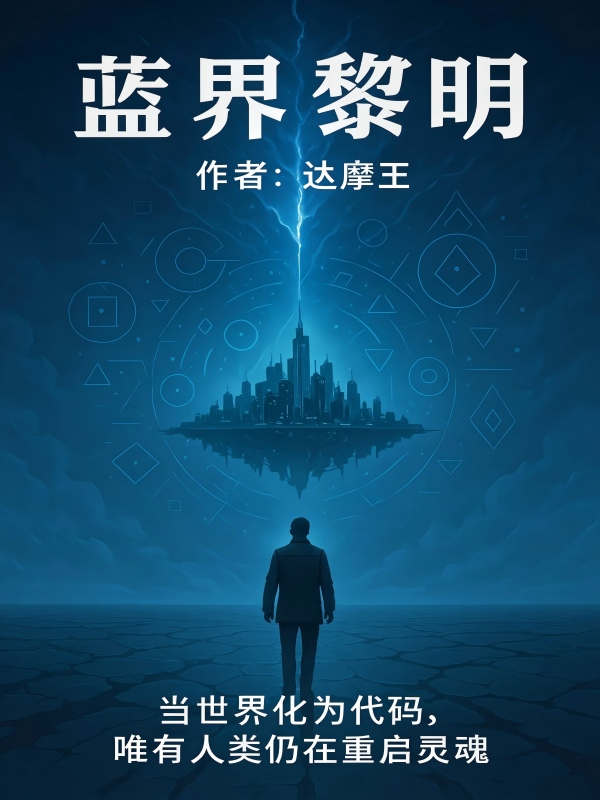

# 蓝界黎明
| 作者：达摩王

---

## 序章：蓝界黎明

公元 2158 年，蓝星在一次“量子坍缩”后，与另一维度的“灵界”发生空间叠合。
一夜之间，地球被纳入“灵域系统”，每个生命体都被赋予一个「界印」。
人类文明崩塌，新的秩序开始重组——修炼者、界兽、机械族并立，
蓝星成为“多界试炼场”。

——

最初的坍缩，只是一场能量异常。
随后，天空被撕开，海洋倒流，大地漂浮。
城市的形状被扭曲，山脉像纸张一样折叠。
人类以为那是末日，却不知道，
那只是“系统更新”的启动信号。

在灾变之后，世界浮现出一行文字：

【灵界融合协议 · 启动】
【第99号试炼场 · 蓝星 · 状态：初始化中】

从那一刻起，现实被重新定义。
时间以数据的形式流动，
生物被编号、重构、编译。
界印刻在每个生灵体表，成为生存的唯一凭证。

血肉与金属共生，灵能与代码互通。
修炼者用意念驱动灵气，
机械族以算法进化形态，
界兽吞噬数据碎片，成为“领域之主”。
蓝星的文明，不复存在；
取而代之的，是被称作「灵域系统」的秩序。

——

人类曾经统治世界，
如今，他们只是系统中的变量。
一部分人觉醒了界印权限，被称作“觉醒者”；
他们能读取灵界代码、改写构灵规则。
也有人被数据侵蚀，堕入深渊，化为界兽。

【提示：生存即试炼，进化即通行。】
【所有结果，均由界印判定。】

而在坍缩的废墟之中，一个名叫林岚的机械师醒来。
他在绝望的光雾中抬起手，
看见掌心浮现出复杂的几何印记。

那一刻，他还不知道——
这枚界印，将让他重写世界。

——

蓝星坍塌之夜，被后世称为「坍缩纪元的黎明」。
旧文明的终结，
正是新秩序的开始。

【蓝界纪元 · 记录开始】
【系统日志编号：0000-01】
【任务：重启文明节点】
【状态：待觉醒。】

——

《蓝界黎明》序章完。

---

# 卷一：坍缩纪元

---

## 第1章 坍缩之夜
夜色压得很低，像一层被数据污染的雾。

南城机械研究所的灯光在闪烁，控制屏发出轻微的蜂鸣。

林岚还在加班。

他是一名机械工程师，负责维护量子伺服臂的稳定程序。

今晚，他只想早点完成工作，然后接妹妹安然回家。

终端上忽然弹出一条讯息——

【哥，今晚的星星好奇怪，好像在流动。】

林岚笑了笑，随手回了一句：

【别乱想，赶紧睡。】

下一秒，世界仿佛听到了他的回复。

天花板传来一声低沉的轰鸣，

玻璃震碎，灯光熄灭，

整个研究所陷入黑暗。

外面的天空——亮了。

那是一种无法形容的亮。

星辰不再闪烁，而是像液体一样流动、旋转、塌陷。

一道白线从天穹贯穿大地，

将城市生生劈开。

林岚透过玻璃看见，街道在崩裂、楼宇在漂浮。

仿佛整个世界被人“掀起”了一角。

重力失效，一切都在上升。

他刚想冲出实验室，脚下的地板忽然塌陷。

轰——！

光吞噬了一切。

二、失联

当意识重新拼合，他正漂浮在半空。

脚下是翻转的街道，天与地颠倒。

空气变得浓稠，时间像被冻住。

他看到悬浮的汽车、扭曲的信号塔，

还有人——静止在空中，

表情定格在惊恐的那一瞬。

“地震？爆炸？还是梦？”

林岚艰难地移动身体。

他伸手去触碰身旁的安全带残片，

就在指尖碰到金属的刹那——

皮肤下涌出一道光。

掌心浮现一个复杂的几何印记，

光纹环绕、线条延展，像是活物在爬动。

脑海中响起一个陌生的机械声：

【检测到绑定个体：林岚】

【界印系统激活中……】

【生存协议启动】

【倒计时：72小时】

那声音冷得像冰，

带着机械的节拍和数据的回声。

林岚猛地后退，背靠着残墙喘息。

“界印系统？什么鬼？”

无人回答。

只有远处的天空在开裂——

巨大的能量光幕从天际坠落，

那光柱击穿地面，

将整座城市映照成蓝白色的海洋。

他抬头，看见云层上方漂浮着巨大的阴影。

那是一座城市——

倒悬的城市，

在天空缓缓旋转。

三、废墟

几小时后。

风停了。

重力重新拉回。

碎片落下，建筑倾塌，

南城彻底化为一片废墟。

林岚从残骸中爬出，

全身布满细微的光线，

界印仍在掌心微微脉动。

他找到了妹妹的通讯终端，

屏幕碎裂，只有半行信息：

【哥，我看到天上有……】

信号戛然而止。

他握紧终端，喉咙发紧。

耳边再次响起那个冷静的声音：

【任务生成中……】

【目标：修复系统节点。】

【奖励：权限提升。】

【失败：数据解构。】

界面在他眼前展开——

蓝色的光幕如薄雾般漂浮。

上面是一个闪烁的能量条，

底端显示：能量值 0.3%。

“还真像游戏。”他喃喃道。

“但这里没有重来。”

远处传来低吼。

他抬头，看到一只“人类”的影子在废墟中踉跄前行。

那人的皮肤泛着金属光泽，双眼全是蓝色光点。

当它张开嘴时，声音像被电流撕碎：

“数……据……给我——”

林岚倒吸一口气。

那不是人类。

那是被系统“重编”失败的生物。

【检测到异常体：界兽】

【能量等级：E】

【建议：逃离或战斗。】

“战斗？拿什么打？”

他下意识后退，脚下踢到一块钢板。

界印的光线自动延伸，将那钢板包裹。

瞬间，钢板在他手中扭曲、重构，

变成一柄泛着蓝光的短刃。

【构灵成功：能量导流刃】

【耐久：10%】

“……这玩意真能用？”

界兽扑来。

他反射性地横劈，

蓝光闪过——界兽胸口被切开。

伴随一声金属破裂，

黑雾四散，残留的晶体悬浮在空中。

那是一个拇指大小的能量球。

界印自行吸收了它。

【能量吸收完成】

【获得构灵模块：能量回路】

【系统进度：5%】

一股温热的力量顺着血脉流动，

痛楚与寒意一并消散。

他的呼吸变得平稳，视线也更清晰了。

林岚看着掌心的界印，轻声道：

“原来……我也被系统选中了。”

四、界印的低语

夜，彻底陷入沉寂。

风带着微弱的电子噪音。

林岚靠在断墙边，

眼前是一座被掀开的城市——

像被神从内部剥开。

他抬头，看到天空中仍悬着那道光裂，

里面漂浮着碎裂的大陆、流动的瀑布、

还有无数闪烁的方块。

那是灵界。

另一个世界，正在与蓝星融合。

【提示：灵域系统初始化中】

【试炼场：蓝星】

【倒计时：71:32:54】

林岚闭上眼。

脑海中闪回妹妹被光吞噬的瞬间，

胸口一阵刺痛。

“你还活着，对吗？”

他握紧拳头。

界印随之亮起，

蓝色光线顺着手臂爬升，如同脉搏。

他站起身，

望向那片坍塌的天幕。

远处的废墟中，

无数微光在游动——那是新的生命，也是新的威胁。

界印的声音再次响起：

【新任务：追踪能量信号源。】

【方向：东·裂谷区。】

【任务等级：F。】

林岚深吸一口气，

将破碎的通讯终端揣进口袋。

“好……那就从那里开始。”

他拾起那柄微弱发光的导流刃，

背影映在燃烧的夜色中。

天幕的另一端，

一道巨大的数据光环缓缓旋转——

像一只注视人类的眼睛。

【蓝界纪元·启动。】

（第一章完）

---

## 第2章 系统觉醒者
一、废墟之晨

晨雾弥漫，天空依旧是碎裂的蓝。

坍塌后的南城像一具巨兽的骸骨——冷、静、死气沉沉。

林岚蜷缩在一座倾倒的高架桥下，

火光映着脸，他盯着掌心的界印。

整夜，那个倒计时一直闪烁着。

【剩余时间：71小时05分】

【任务：追踪能量信号源】

【方向：东·裂谷区】

他抬头望向东方。

那片区域原本是能源研究带，如今被一道深不见底的裂痕吞没。

那里……或许就是安然最后的信号源。

林岚深吸一口气，将那柄残破的“能量导流刃”插入地面。

武器表面已经出现裂纹，光线黯淡。

他调出界印界面，尝试解析结构。

【模块：能量回路（初级）】

【功能：导流、放电】

【构灵核心：单向流体能量】

“导流回路、单向能量……换句话说，这玩意只是临时能量放大器。”

他低声自语，眼神一点点冷静下来。

理性重新掌控了情绪。

“要活下去，就得自己造出能用的东西。”

二、构灵实验

他在废墟中翻找，找到几块残余的能源电池、破损的机械臂，还有被烧黑的能量晶体。

这些原本是能源塔的零件，如今成了他唯一的资源。

他将所有零件摆成半圆形阵列，

界印投射出光幕，形成虚拟接口。

【检测到能量源碎片】

【是否进行“构灵尝试”？】

【风险提示：失败率 68%。】

“没得选。”

林岚点头。

界印亮起，蓝光顺着地面蔓延，像一张电路图。

空气中浮现出密密麻麻的符号与数据流。

那一刻，他仿佛站在一个虚拟的操作台前——

所有零件都被分解成公式、能量、材质、连接值。

“这就是……构灵系统。”

他伸出手，调整数据节点。

能量晶体被切分、嵌入机械臂的接口，

电池的输出回路被重新定义，

代码在空气中闪烁：

【结构稳定性：52%】

【能量流通率：47%】

【安全值：不达标。】

“安全值不重要，能动就行。”

他修改变量，手心的界印剧烈发烫。

轰——！

蓝光炸裂。

尘土飞扬。

当光芒散去，

地上多出了一副由废料拼成的半身机械装甲。

表面布满裂痕，却在呼吸。

【构灵成功】

【模块：G-01灵构装甲】

【核心能力：能量防御/动力放大】

【系统进度：12%】

林岚嘴角微微上扬。

“第一个成果——勉强能活下来。”

他穿上装甲，金属与皮肤契合的瞬间，

冷流从界印一路蔓延到胸口。

呼吸更顺畅了，身体的重量也变轻。

HUD界面自动在眼前展开：

【当前防御指数：32】

【当前力量放大倍数：1.4x】

这一刻，他第一次感受到“系统”的力量。

三、第一次狩猎

他沿着东裂谷前行。

空气带着硫磺和铁锈的味道，

地面遍布烧焦的电路纹理，像是整个世界的皮肤被烧穿。

界印不断闪烁提示：

【能量信号强度上升】

【检测到生命反应：E级界兽× 3】

林岚放慢脚步，拉起护目镜。

三只界兽从废墟后方钻出。

它们体型类似猩猩，但皮肤由金属和碎裂的骨刺构成，

蓝色能量流在血管中奔腾。

“E级……可以测试一下。”

他握紧导流刃。

第一只界兽扑来。

他侧身躲避，反手一记电弧斩，

蓝光沿着金属裂纹穿透界兽的躯体。

那怪物发出刺耳的嘶吼，倒地化为灰尘。

【击杀成功】

【获得灵核× 1】

【能量补充：+3%】

第二只从侧面突袭。

林岚启动装甲的动力模块，

喷射器爆出气流，他的身影瞬间滑行数米，

一记下劈——导流刃斩断了界兽的肩膀。

【连续击杀×2】

【临时战斗状态：强化+10%】

最后一只更大，眼睛发出红光。

它的吼声带着共振，附近建筑的玻璃全部碎裂。

林岚退无可退。

“装甲过载启动。”

他低声指令。

【过载确认：请注意能量消耗。】

【3…2…1——】

装甲喷出蓝白色光焰，

他整个人化为一道流光冲出，

电弧划过天空，

在界兽的头顶留下灼烧的裂痕。

轰——！

爆炸的余波掀起尘浪。

等一切归于寂静，

三枚灵核漂浮在空中，被界印自动吸收。

【能量总值：25%】

【系统进度：22%】

【获得技能：能量脉冲（初级）】

蓝光在他胸口闪烁，

装甲表面的裂痕自动修复。

“这……才像样。”

他抬起头，望着东方那片越来越亮的天空。

裂谷的方向，似乎有某种巨大的能量源在呼吸。

四、裂谷

傍晚。

天色像被烧焦的金属，红黑交错。

裂谷区的边缘已经失去了形状——

地面悬浮、岩石倒挂、

整个空间像被揉皱的纸。

林岚打开扫描界面。

【能量浓度：异常】

【磁场状态：不稳定】

【检测到系统节点反应——距离：600米】

“系统节点？”

那是他任务中的目标。

他沿着断层下滑，

裂谷底部传来微弱的光。

空气中漂浮着碎片般的光粒，

每一粒都像一个正在坍塌的世界。

他蹲下身，伸手触摸地面。

石层下有一块金属装置，表面刻着古老的符号。

界印自动反应，光线延伸，与装置链接。

【节点解析中……】

【错误：权限不足】

【请求临时提升权限？】

林岚沉默几秒，点头。

【授权通过。】

【系统进度：30%】

【副作用：能量消耗加速。】

装置发出刺耳的共振声，

一片蓝色光幕从地底升起。

那是一段残缺的影像。

一个女人的声音，从数据流里传出：

“……第99号试炼场已失控……蓝星……无法修复……”

“若听到此记录，请执行反编译协议。”

声音戛然而止，

画面碎裂成光。

【新任务生成】

【主线任务：重启文明节点（1/12）】

【副任务：搜集反编译代码碎片】

林岚怔怔地站在光幕中。

“反编译……那就是说，系统可以被重写。”

他抬头望向天顶。

那条天裂此刻正缓缓旋转，

像某种有生命的瞳孔。

五、选择

界印再次闪烁：

【能量警告】

【系统进入冷却期】

【建议：休眠】

林岚靠在岩壁上，

闭上眼，胸口的界印光芒渐暗。

他能听见远处风的回声，也能听见某种低频的呢喃。

那不是风。

那是灵主的声音。

【数据……进化……筛选……】

他睁开眼，瞳孔里映出反射的蓝光。

“你可以筛选别人，

但我也能筛选你。”

他站起身，

背对着裂谷深处的光，

朝更远的废墟走去。

头顶的界印系统再度发出提示：

【任务更新】

【目标：寻找构灵资源，建立初始防御据点】

【奖励：权限等级+1】

林岚深吸一口气。

他已经不再是昨夜那个被坍塌拖入深渊的工程师。

他现在，是——

系统觉醒者。

（第二章完）

---

## 第3章 裂谷之下

一、东裂谷边缘

风声低沉，像巨兽在呼吸。

林岚站在裂谷的边缘，

目光投向那道贯穿城市的深渊。

裂谷从南城一直延伸到天际，

宽达数公里，深不见底。

裂缝中流动着蓝白色的能量雾，

仿佛海洋在倒流。

空气中的重力在不断变化，

每一步都像走在液体里。

界印的光在他掌心跳动。

【任务：调查能量信号源】

【环境风险：高】

【推荐装备：防重力模块】

“防重力模块？我哪来的那玩意。”

林岚环顾四周，只有断裂的电塔和废弃的无人机残骸。

他想起前一章获得的构灵模块，

便调出系统界面。

【可构灵模块：能量回路】

【可选增生组件：废弃飞行核心×1】

【是否构建辅助模块？】

“开始。”

界印光线在地面展开，

像电路一样连接残骸与他手臂上的装甲。

几秒后，装甲背部的气阀被重新定义，

生成一对简陋的推力喷嘴。

【构灵成功】

【模块：防重力辅助装置（G-01改）】

【状态：不稳定】

林岚活动了一下肩膀。

喷嘴发出轻微嗡鸣，他整个人离地十厘米。

“勉强能用。”

他深吸一口气，跳入裂谷。

二、坠落与异响

下坠的时间超出了他的预期。

风从耳边呼啸而过，

光在脚下翻滚。

在深渊的中层，

漂浮着巨大的碎片——像是城市的残骸被冻在空中。

每一块碎片上都刻着发光的符号，

组成巨大的矩阵。

他调出界印扫描：

【检测到灵界碎层】

【数据结构：半稳定】

【能量指数：超标】

【警告：此区域不属于蓝星物理层。】

“原来这就是‘叠合点’。”

他在碎片间穿行，寻找稳定落脚点。

不远处传来一阵类似机械的咆哮声。

他警觉地停下。

一只巨大的界兽从残骸下方爬出。

它的身体像机械蜘蛛，却覆盖着半透明的能量膜。

八条腿闪着蓝光，每一步都让空气震颤。

【检测到敌对单位】

【能量等级：D级】

【战斗建议：回避】

“回避？太迟了。”

蜘蛛状界兽喷出一道光束，

他被迫启动喷射器躲闪，

光束擦过肩膀，装甲瞬间熔化一块。

他落在另一块碎片上，

迅速锁定能量节点。

导流刃启动，蓝光汇聚在刀锋。

他深吸一口气，

跳跃、旋转、下劈——

光弧在空中划出一条完美的弧线。

刃锋切开界兽的头部，

能量核暴露。

他伸手触碰，界印立即吸收那枚能量核。

【击杀成功】

【能量回收：+10%】

【系统进度：38%】

【获得构灵素材：灵界晶骨×1】

蓝光在他身上蔓延，

装甲自行修复，

喷射器的推力也更稳定了。

“看来灵界的素材比蓝星的更高级。”

他继续下降，

光线逐渐变暗，

只有裂谷底部散发着诡异的银蓝色光。

三、信号

地面覆盖着未知的金属层，

每一步都会引发回声。

林岚打开扫描界面。

【检测到能量波动】

【类型：通讯信号】

【来源：人类设备】

心脏猛地一紧。

人类通讯？

这意味着——安然，或者其他幸存者。

他顺着信号走去，

穿过一片倒塌的能量塔残骸。

那些金属表面仍在发热，

上面刻着与灵界文字类似的符号。

信号越来越强。

界印投影出一条虚线指引方向。

他终于在一处能量湖边停下。

湖水泛着光，仿佛液态的数据流。

在湖的中央，

一具女性机甲静静漂浮，

胸口的徽章是——南城能源研究所。

林岚的呼吸骤停。

那是安然的研究机构。

他立刻启动扫描：

【机体识别：A-17】

【状态：离线】

【是否接入？】

“接入。”

界印释放光线，与机甲链接。

几秒后，机甲的眼部亮起微弱的蓝光。

一个虚影在他面前成形——

是安然。

但她的轮廓不再完整，身体的部分数据在闪烁。

“哥……你终于来了……”

她的声音混杂着噪音。

“安然！你在哪里？”

“别靠近……这里不是……地球……”

“我们被上传了……灵界……是监狱……”

声音断断续续。

她伸出手，虚影几乎要触碰到他，却在下一秒彻底崩溃。

【数据连接中断】

【记录碎片保存成功】

界印提示：

【获得任务：寻找安然意识碎片（0/5）】

【系统进度：45%】

林岚跪在原地，拳头紧握。

“监狱……你说的监狱，是指整个蓝星吗？”

无人回答。

只有能量湖的波纹在闪烁。

四、遇袭

警报忽然响起。

【检测到多重能量反应】

【敌对单位数量：未知】

蓝色的光点从裂谷另一侧飞来，

是人类——至少外形如此。

他们全身穿着灰银色装甲，

胸前印着一个标志：

界兽狩猎团。

为首的是一个目光冷峻的男人，

他手中的能量枪稳稳对准林岚。

“别动。”

“报告你的界印编号。”

林岚皱眉：“界印编号？我刚从地表下来。”

那男人冷笑：“地表人？那你更危险。”

身后的女队员低声说：“凌天寰，他的界印反应异常。”

“异常就意味着不稳定，”凌天寰抬起枪口，“不稳定的觉醒者，必须清除。”

能量枪汇聚蓝光。

林岚的界印同步发光，自动调出防御模式。

【防御系统启动】

【反射装甲：充能中】

两股能量几乎同时释放——

轰然爆炸。

烟尘中，林岚被震退数步，

装甲裂开，导流刃化为光屑。

他咳出一口血。

“你们疯了吗？我不是敌人！”

凌天寰冷冷回应：“灵界感染者都会这么说。”

战斗再次爆发。

林岚靠喷射器滑行，避开数次射击，

拾起地面碎片重新构灵。

【紧急构灵：防御盾牌（临时）】

光盾展开，他挡下正面的冲击波。

同时利用能量反弹，反手一记电弧掷出。

轰！

冲击波将两名狩猎团成员掀翻。

战场陷入短暂的寂静。

凌天寰放下枪，

冷静地看着他。

“有意思。你不是普通觉醒者。”

林岚喘着气：“你们到底是什么人？”

“幸存者联盟。”

“听说过‘界印反编译者’吗？”

林岚愣住。

那是安然口中提到的词。

凌天寰微微一笑：“看来，我们要谈谈。”

五、裂谷之下

他们在裂谷底部搭起了临时营地。

火光映在岩壁上，照出一个个破碎的符号。

凌天寰解释说，他们是由各地幸存觉醒者组成的团队，

目标是在灵界系统彻底接管前，

找到“反编译协议”并重启人类控制权。

“反编译协议？”林岚皱眉，“那东西存在？”

“当然。每个界印系统都是双向的。”凌天寰说。

“既然它能编译生命，就一定有反编译的方法。”

林岚沉默。

他想起妹妹的虚影，也想起那段残缺的警告。

——反编译协议。

凌天寰盯着他：“你的界印等级超出常规。你可能就是关键。”

林岚没有回答。

他看着天顶那道幽蓝的裂缝，

光从中垂落，像另一片天空。

【系统提示：阵营分支已解锁】

【可选：独行/联盟】

【选择将影响任务线】

林岚低声笑了一下。

“系统也开始让我选阵营了？”

他抬起手，

界印光芒照亮整片裂谷。

“那就……从这里开始吧。”

（第三章完）

---

## 第4章 界兽狩猎团

一、废墟之火

裂谷底部的营地被残骸围成环形，

废弃的能源塔被改造成照明装置，

蓝白色火光将周围的阴影照得支离破碎。

林岚坐在破损的机械臂旁，

看着胸口的界印——

光线仍在跳动，稳定却陌生。

他已经很久没有听到系统的提示声，

那种寂静反而让他更加不安。

身后传来脚步声。

凌天寰走了过来，银灰色装甲反射着火光。

“还在担心你妹妹？”

林岚抬头：“她的信号消失在这片裂谷，我得找到她。”

“找人之前，得先活下来。”

凌天寰扔给他一块能量晶核。

“装甲修复材料，算是欢迎礼。”

林岚接过，界印自动吸收能量，装甲的裂缝瞬间愈合。

【能量修复完成】

【状态：稳定】

“你们这群人，到底是谁？”林岚问。

“界兽狩猎团。”凌天寰回答得很干脆，“人类最后的猎人。”

二、团的律令

夜深，狩猎团成员围在能量炉旁。

十几名幸存者，男女不等，身穿各式界印装甲。

他们的界印颜色各不相同：红、蓝、银、黑——

等级与权限的象征。

纪若寒，是团里的副指挥。

她的界印在右眼位置，

每次闪光时，她的瞳孔都会呈现出数据网格。

她递给林岚一块识别终端。

“新成员信息录入。代号‘机械师’。等级待定。”

【系统提示：加入阵营——界兽狩猎团】

【阵营信任度：10%】

【开启阵营任务分支】

林岚看着终端屏幕，出现新的任务栏。

【阵营任务：协助狩猎团防御南裂谷】

【目标：击退界兽群】

【奖励：构灵权限+1】

“这任务……”他皱眉。

纪若寒笑道：“简单点说——守住营地，不死就行。”

三、狩猎者的夜

夜风吹过裂谷，带着烧焦的味道。

林岚和纪若寒并肩站在警戒塔上，

俯瞰下方黑暗的峡谷。

远处闪烁着点点蓝光。

那不是星星，而是界兽的眼。

“它们在靠近。”纪若寒的语气极稳。

“夜袭？”

“每个夜晚都有，只是今晚的规模……更大。”

界印投射出的防御网在营地上方展开。

能量墙闪着微光，像倒扣的半球。

林岚看着那层光幕，

感受到一股熟悉的能量波动——

那是灵界能量，与他的界印源相似。

“这些防御装置，都是从灵界材料改造的？”

“没错。”纪若寒回答，“我们用敌人的力量对抗敌人。”

风声渐起，

地面震动。

【警报：界兽群接近】

【数量：42】

【最高等级：D】

纪若寒转身大喊：“防线一、二启动！狩猎序列开启！”

四、夜袭

蓝色的兽群从裂谷深处冲出，

数量超乎想象。

它们奔跑的声音像浪潮，

金属的躯体在月光下闪烁。

防御塔上的能量炮齐射，

光束撕裂夜色，

爆炸的冲击波震得空气扭曲。

林岚启动装甲，加入前线。

导流刃重构完毕，双臂被光环覆盖。

【战斗状态：激活】

【能量脉冲模块启动】

第一只界兽冲上石坡。

林岚迎面一击，电弧穿透它的胸腔。

爆裂的灵核碎片散落在空中，被系统吸收。

他快速移动，在防线间游走，

反应比人类极限还快。

纪若寒通过通讯喊道：

“机械师，你左翼有破口！”

林岚滑步转向，

看到三只界兽正从能源塔下方突袭。

他提气，界印闪烁。

【紧急构灵：能量护壁（小型）】

蓝光立起，护壁成形。

界兽撞上光幕，被反震回去。

林岚趁机冲刺，连击三斩——

每一刀都伴随系统提示声。

【击杀×3】

【能量进度+6%】

爆炸的光芒映亮了整个裂谷。

五、反击

战斗持续了一个小时。

防御网开始闪烁，能量塔输出下降。

凌天寰冷静地下令：“第二层防御阵列启动，纪若寒，带队反击！”

“明白！”

她拔出双刃，跃下防线。

蓝光在她脚下爆发，如同流光。

林岚紧随其后。

他们一前一后，杀入兽群中心。

界印之间的能量产生共鸣，

两人的动作被系统自动同步。

【共振同步率：87%】

【临时连锁技能激活：能量冲击波】

轰——！

半径二十米的区域被蓝色光波覆盖，

所有界兽瞬间瓦解。

纪若寒收刀，喘息间笑了一下：“不错嘛，新人。”

“你也不赖。”

战斗渐渐平息。

地面上只剩灵核和残骸。

系统提示音连续响起：

【任务完成】

【阵营信任度+20%】

【构灵权限提升】

【获得新模块：能量稳定器】

凌天寰走来，

表情一如既往的冷。

“你超出预期了。”

林岚淡淡回应：“我只是不想死。”

“在这个世界，能不死就是天赋。”

六、系统阴影

夜深，风停。

营地暂时恢复平静。

林岚坐在火堆旁修复装甲。

他发现，界印界面里多出一个新的选项：

【阵营权限：开放中】

【可申请：副指挥授权】

他皱眉。

系统为什么会在这种时候“提升权限”？

它是在认可他的实力，

还是在引导他——向某个方向靠拢？

他翻看战斗记录，

数据在一页页滑动，

直到最底部的一行：

【灵主观测中……】

他心中一寒。

“系统在监视我们。”

纪若寒走来，递给他一杯能量液。

“别想太多，睡一会儿。明天还得修复防线。”

“你不怕？”

“怕。但我们只能在怕中活下去。”

林岚抬头，

夜空依旧裂开，

裂缝中闪烁的光仿佛在眨眼。

那一刻，他突然明白，

蓝星已经不属于人类——

而系统，只是在挑选新的统治者。

他低声道：

“要么被选中，要么重写它。”

界印轻轻一亮，像在回应。

【提示：主线任务更新】

【目标：深入裂谷核心，定位文明节点二】

【副线：调查灵主观测信号】

林岚站起身，目光变得冷冽。

“看来，我还得下去一次。”

（第四章完）

---

## 第5章 灵主的低语

一、遗迹舱门

凌晨三点，裂谷风像从金属管中吹出，冷得生疼。

营地外围的警示灯间歇闪烁，像病人的心电波。

纪若寒把一块擦得发亮的金属片递给林岚：“能读懂吗？”

金属片来自昨夜战场最深处的界兽胸腔，表面刻着细如发丝的符号。

林岚将它贴近界印，淡蓝色的光线自掌心蔓延，爬满整片金属。

【异源芯片】

【协议：Ω-语义/层级-03】

【状态：可解析（权限不足）】

“还是‘权限不足’？”纪若寒皱眉。

“不是完全不行。”林岚低声，“它像一把门钥匙，但我们缺最后一道指纹。”

凌天寰走来：“别耗在猜测上。目标是裂谷下层能源遗迹，找到节点二。”

他抬手，界印投射出一张立体地图：裂谷底部，标记着一个环形结构，像一朵金属花。

——能源遗迹的核心舱门。

“编队，三人突入，小队支援。林岚，你跟我。若寒，信号侦测。”

“收到。”

他们沿着折断的能量塔下切，经过一段重力紊乱带，落在环形结构外缘。

近看，舱门更像一枚巨大的瞳孔：同心圆彼此咬合，表面流淌细密的光。

每一次光纹跳动，周遭的空气就发生一次细微扭曲。

纪若寒在通联里说：“是‘语义锁’，必须用对应语言开门。”

凌天寰看向林岚：“你是我们这边唯一能写‘代码’的人。”

林岚点头，深吸一口气，把异源芯片扣进界印接口，心跳随之与光纹同步。

他开口——不是语言，更像某种节奏：

“∷-Ω/α…01…bind…open…”

舱门没有动。

但在某个听不见的频段里，有人回了一句。

那声音像在脑海里滴落水珠：

——/识别到低级构灵语。

——/权限：试炼体。

——/查询：意图？

林岚额角渗汗，继续输出构灵语：“请求——‘节点二’访问。”

沉默半秒，舱门光纹倒流，中心逐层展开。

一阵低沉的共振滚出，像远雷，又像是心跳。

“进去。”凌天寰说。

二、能源遗迹

遗迹内部像无重力船坞，层叠的舱壁悬浮在空中，每一枚铆钉都在微微颤动。

地面不存在；他们沿磁轨前行，脚下的“轨道”随脚步生灭。

中央悬着一枚椭圆形的“心脏”——

半透明，内部是跳动的光流，周围悬浮着十二块黑色石棱。

每一块石棱上都刻着与界印相似的几何印记。

【文明节点·02】

【状态：损坏/旁路可写】

【危险：高】

【建议：仅在守护程序关闭时写入】

纪若寒在通联里道：“守护程序的波形和昨晚入侵我们梦的那个频谱一致。”

林岚心口一紧：“你也做梦了？”

“不是梦，是被动式意识同步。灵界在用‘梦’做广播。”

凌天寰抬手示意：“先别讨论。两分钟内完成备份，尝试旁路接入。”

林岚贴近“心脏”，界印自动亮到刺眼。

他仿佛站在一台巨型主机前，手指每一次轻敲，周围符号就像星海起伏，语义在空间折叠。

【旁路接入中……】

【注意：守护程序即将回归】

“快了。”林岚低声，“再给我十秒。”

第九秒，空间暗了一瞬。

像有人从很远的地方，睁开了眼睛。

——/试炼体，未经授权的写入。

——/停止。

声音直入脑髓，不是通过耳朵，而是直接让“思考”产生回音。

林岚强忍眩晕：“你是谁？”

——/命名无意义。

——/你们称我：灵主。

——/回答：你为何试图改写蓝星？

凌天寰迅速切入：“拖住它。”

纪若寒：“接管旁路，我替你分摊负载！”

两人的界印一明一暗，与林岚的光链接在一起，三人组成临时共振阵列。

灵主的声音继续：

——/第99号试炼场，目标：筛选适存结构。

——/你们的反抗，会降低样本价值。

——/停止写入，回到秩序。

林岚胸口一紧，眼前浮出安然在能量湖中的断裂影像。

“秩序？你把人类上传，把城市折叠，把生命当作数据——这叫秩序？”

——/秩序即高效。

——/情绪是低效噪声。

——/剔除噪声，世界更稳定。

“那灵魂呢？”

——/灵魂的定义？

——/请给出可计算描述。

林岚愣住，竟一时无言。

纪若寒在通联里压低声音：“别被它带节奏。问它——‘反编译协议’。”

林岚收回思绪：“蓝星旧文明档案中记录过‘反编译协议’，它在哪里？”

“心脏”周围的十二块黑石同时震颤。

——/旧文明在第67次试炼中，尝试脱离。

——/失败，已清除。

——/反编译，仅向‘合格样本’开放。

“合格的标准呢？”

——/存活、利用、扩张、服从总体函数最优化。

——/你不合格。

话音落下，遗迹的四壁像海面起风，涌起刺目的白色浪。

守护程序回归。

【警报：守护程序激活】

【建议：断开】

“还差一点！”纪若寒的声音拔高，“再坚持五秒，我能把节点二的目录结构拷一份！”

凌天寰沉声：“我来挡！”

他跃至半空，界印骤亮，银白色的“铳形构灵”在臂上展开。

枪口开合，击出一道并非光、也非火的纯信号。

信号与守护程序撞在一起，空间像细玻璃被划出一道长痕。

【连锁：‘清辉’协议/干涉级别：α-2】

【代价：精神消耗↑】

“林岚，快！”

“好了——”

界印猛地一暗，旁路接入成功中断。

十二块黑石同时回落，心脏恢复最初的均匀跳动。

纪若寒长出一口气：“拷到一部分目录了……我的头……像有钉子在里面。”

凌天寰面色发白，额角青筋绷直，却依旧冷静地收起臂铳。

林岚扶住若寒，低声道：“谢谢。”

若寒笑了笑：“可别谢太早——我们刚刚在它眼皮底下偷了东西。”

“走。”凌天寰道，“回营地再分析。”

三、梦

他们并没有立刻回到地表。

走出遗迹的瞬间，夜色像被倒放。

星光消失，声音全部被抽走，

四周一片空无，只有一个低频的脉冲在反复回荡。

林岚意识到——不是环境变了，而是意识被拽进了某种广播。

如同昨夜的“梦”。

世界突然极度真实：

他站在一条陌生的街道，天空明亮，行人穿梭。

那是坍缩前的南城。

妹妹安然穿着白色制服，从过街天桥跑下来，笑着对他说：“哥，你终于肯休假了？”

“不是现实。”他在心里提醒自己，“是诱导。”

安然凑近，在他耳边低声：“哥，你要不要……放弃？”

“什么？”

“只要点头，灵主会让我们回到‘一切没发生的昨天’。”

她笑，眼睛里却没有光——像擦亮的玻璃珠。

林岚胸口剧烈收缩，几乎无法呼吸。

“安然，我真想回到昨天。可我要的是‘你’，不是你们的模拟。”

安然的脸瞬间静止，像被按下暂停。

下一秒，她整个人像纸片一样从中间裂开，

露出背后的黑色符号阵列。

——/情绪阻抗异常。

——/尝试二级安抚。

——/失败。

林岚闭眼，再睁开，街道消失。

他回到遗迹外的台阶，冷汗浸透。

纪若寒和凌天寰都怔在原地，显然也刚从“梦”里逃出。

“灵主在测我们的‘可控性’。”纪若寒低声，“它用愿望当饵。”

凌天寰抬眼望向裂谷天穹：“这只是开胃菜。回去。”

四、目录

营地临时指挥舱。

若寒把拷出的目录投在空中，像一座由光组成的金字塔。

每一层都是冷冰冰的条目：

/trial/scene/试炼场场景模板

/mind/pacify/安抚算法（梦引导）

/soul/index/意识索引（部分损坏）

/node/reboot/节点重启工具（权限遮蔽）

/compile/lang/语义表（缺项）

/audit/ob/观测列表（星号标注）

纪若寒将“观测列表”展开。

用户清单如雨点落下，末尾一行高亮：

ob_000671: Lin_Lan/*

risk:高

tag:编译倾向/阵营不稳定

空气仿佛瞬间冷了一度。

林岚盯着自己的名字，喉结轻跳。

“我被‘灵主’重点关注了。”

凌天寰面无表情：“从你打开节点二那一刻起就被标记了。好消息是——这意味着你能做到别人做不到的事。”

“坏消息呢？”

“从现在起，你每一次‘进步’，都会被它当作风险。”

若寒又展开“语义表”。

“看这儿，语言表缺了一块，像故意被裁走——构灵语·反编译语。”

“被挖走了？”林岚眼睛一亮，“谁干的？”

“旧文明？”若寒推测，“或许是它们留给后人的‘逃生线’。”

凌天寰冷声：“不管是谁，我们只要找到那块缺口，就能写死它的规则。”

林岚沉吟片刻：“那就从‘soul/index’入手。

如果灵主把人类意识都挂在索引上，安然也一定在其中。

找到了她，就能顺着路径摸到‘反编译语’。”

若寒点头，手指飞快滑动，“索引损坏很严重，我得做指纹比对。给我一点高质量样本。”

林岚从怀里取出安然的发夹，轻放在台面。

界印自动读取，上浮出细密的波形——

那是个人意识的微弱“习惯频谱”：步态、语速、微反应……

舱内静得只剩运算声。

十六秒后，一条极细的红线从“soul/index”的深处亮起。

如同在黑色海底，看到一根跃动的渔线。

若寒屏住呼吸：“捕到了……但只有一帧。”

屏幕一闪，安然的轮廓浮现不到半秒，随即消失。

林岚下意识伸手，像要抓住她一般。

【系统提示：获得“意识碎片·A（1/5）”】

【隐蔽任务开启：意识还原】

【风险：极高】

凌天寰看着那条红线：“我们需要更深的权限。”

若寒抬眼：“或——一个能分散‘灵主注意力’的更大动作。”

五、分歧

“我建议直接攻打节点三。”凌天寰的声音像刀，“趁它还没完全反应过来。强攻能逼出更多目录。”

若寒摇头：“我们需要‘语义表缺项’，不然只是打洞。灵主修复速度很快，打完我们什么都留不住。”

两人目光碰撞，舱内气压像掉了半格。

凌天寰转向林岚：“你说。”

林岚沉默片刻：“我选第三条路。”

“说。”

“做一次‘反编译语’的‘伪造’。”

若寒眼睛一亮：“假装我们已经掌握了缺项？”

“对。灵主是效率机器，一旦判定‘我们具备改写它的可能’，它的首要策略不是全力绞杀，而是——安抚与收编。”

凌天寰冷笑：“你赌它会‘招安’？”

“我赌它符合自己的函数。收编比绞杀便宜时，它会选收编。那样，我们能换来时间，换来更深的目录。”

若寒快速推导：“我们需要一个能广播到节点级别的‘假信号’，让它误判你的权限级别……同时，还要有一个人作为‘被收编的楔子’。”

凌天寰盯着林岚：“你想把自己送进去？”

林岚平静：“我被标记了，风险标签最高，我是最合适的诱饵。”

空气短促一滞。

若寒压低声音：“我可以在你界印里做一层‘保护壳’，把我们的‘语义伪造’包在最外层，真权限藏里面。”

凌天寰缓缓点头：“可以。但条件——一旦它要把你推到代理层，我会亲手击穿你，在你被同化前。”

林岚看着他：“成交。”

三人的界印同时亮起，光线在空中织成一个细密的环。

那不是盟约，更像一段共犯协议。

【阵营协作协议成立】

【临时共享：构灵语缓存】

【风险：集体观测↑】

警报忽然响起。

外围哨塔传来断续通话：“西北面……二次浪潮……数量……超过……D级……”

凌天寰收回光：“准备迎战。”

林岚转身却被若寒拉住：“等一下。”

她将一片薄如蝉翼的金属膜按到他颈侧，金属即刻隐入皮肤。

“‘壳’装好了。每当你听见‘旧城海风’这四个字，就停止说话——那是我们约定的停机词，防止你被它诱导说出真权限。”

林岚愣了一下，点头：“记住了。”

六、墙外之战

营地上空，防御网再次展开。

这一次，界兽不仅从地面涌来，还从空中坠落：

它们像被一只无形的手从天幕拧下来，

沿着能量丝线直冲地面。

【数量：>100】

【等级：D~C】

【特性：群体共振/破盾】

“全体就位！”凌天寰大喝。

十几道身影跃上防线，能量炮、导流刃、脉冲弓在黑暗中开花。

林岚启动G-01装甲，全功率输出。

他和纪若寒左右夹击，在第一道破口处强行“缝盾”。

每一次构灵都像把自己的思绪拉出去又塞回来，痛得他眼前发黑。

轰！

一头C级界兽撞穿侧壁，把他和若寒一起掀飞。

空中翻滚的瞬间，林岚看见天幕：

裂缝中，一圈更深的暗影正在收缩，像是某种巨大而冷静的虹膜。

——/观测到目标：Lin_Lan/*

——/异常权限波形。

——/判定：接触。

“来了。”林岚喉结一动，对纪若寒说，“借我三秒。”

他收束精神，界印骤然爆亮。

若寒立刻把自己的界印与他并联，把能量枯竭的“苦味”压回去。

林岚在意识里写下一行——假的——构灵语：

grant / compile :: reverse_semantics /α-ghost-key

那不是钥匙，只是一枚做得极像的蜃楼。

灵主的声音当即落下：

——/检测到“反编译语”影像。

——/试炼体具备潜在可编译性。

——/建议：收编→观察。

下一秒，空中的压力骤降，群兽像被人按了暂停。

防御网“嗡——”地一声回弹，支架不堪重负，一根根折断。

“全员稳住！”凌天寰顺势反击，银白臂铳划出长线，将临近的C级界兽全部击穿。

三十秒的攻势，战局被粗暴地压回均衡。

林岚耳后泛起冰凉。

——/Lin_Lan/*，你被允许进入“安抚层”。

——/交出控制权，享受“旧城海风”。

“停机词。”纪若寒在通联里提醒。

林岚闭上嘴，一字不发。

他的界印外侧那层“壳”自动合拢，将假钥匙的光折回去，只露出“可收编”的表面波形。

灵主没有获得更深的权限，只在外面绕圈。

——/观测期开始。

——/代理邀请：待定。

灵压褪去，兽群抽搐着后退，像潮水散去。

整个营地只剩下疲惫的喘息声与金属散热的嘶嘶声。

七、低语之后

战后统计在风里翻页。

伤亡可控，弹药消耗过半，防御网损坏率37%。

凌天寰在简报上写下一句：“可战，不可久战。”

纪若寒把“语义伪造”记录拷进密钥盒，塞到林岚掌心：“别离身。”

“谢谢。”

她忽然看他一眼：“刚才在梦里……你看见谁了？”

“她。”林岚轻声，“不过只是假的。

真正的安然，在索引深处等我。”

凌天寰走来，神情仍旧冷，但声音没有刚才那么硬：“今晚你做对了。

下一步，我们去节点三——无论用打的，还是骗的。”

林岚点头：“走到那一步之前，我还要做一件事。”

“什么？”

“把这段**‘伪反编译语’**变成真的。”

他看向裂开的天空，眼神像刀刃一样亮，“我不想一直骗它。

我要让它有一天搞不清楚——到底谁才是系统。”

界印轻轻一响，像在低低回应。

【主线更新：文明节点二（已接触）】

【支线更新：意识还原（1/5）】

【隐藏线：反编译语（伪）→（真）】

【风险等级：红】

风从裂谷上空吹下，带着金属和盐的味道。

远处黑暗，像一汪巨大的瞳孔，仍在盯着他们。

它既不愤怒，也不怜悯，只在计算。

林岚把密钥盒扣回装甲内槽，站直身体：“走吧。

——去下一扇门。”

（第五章完）

---

## 第6章 冥域试炼

一、节点三·入口

第三天清晨。

裂谷北端的风像刀，吹得界印的光都在颤。

在地表以下三百米的位置，

一扇被岩层包裹的金属门正缓缓显形。

上面铭刻着一个符号——

三角之中嵌着一颗倒置的眼。

纪若寒低声读出扫描结果：

【节点三·冥域】

【权限：系统试炼层】

【状态：封闭】

【开启条件：由“灵主”指派或“代理层”授权】

凌天寰转头：“代理层。那就是我们伪造的那一层。”

林岚点头：“没错。它以为我已经在观测名单之下，理论上可以触发权限。”

“那还等什么？开门。”

林岚深吸一口气，

界印的光向外扩散，触及门的边缘。

门表面的纹理开始流动，像活物一样蠕动。

【确认代理编号：Lin_Lan/*】

【验证通过】

【开启试炼通道】

伴随轻微的震动，金属门缓缓滑开。

一股灰黑色的雾气涌出，

空气中的声音被吞噬，世界像被按下静音键。

他们相互看了一眼，依次踏入。

二、重力十倍的世界

踏入的瞬间，

林岚感觉身体被无形的手猛地拉下。

脚下的地面变成了碎裂的石板，

每一步都重如千斤。

【警告：重力倍率×10】

【建议：启动辅助支撑系统】

他启动装甲的支撑模组，机械脊柱亮起蓝光。

纪若寒的界印则生成一层反向力场，

光圈悬在她脚下，像是踩在一枚旋转的硬币上。

凌天寰依旧沉稳，

银白装甲的结构自动调整，他身形几乎未受影响。

“节点三，不是建筑，是区域副本。”

纪若寒分析着传感数据，“我们每个人的界印都被单独绑定，

这里的‘重力’是智能干预后的精神负载。”

“精神负载？”林岚皱眉。

“换句话说——这里的‘重’，其实是记忆的密度。”

他们抬头望去。

远方漂浮着一座巨大的祭坛，

其上悬浮的不是石块，而是一具具人形——

半透明、静止、无声。

“那些是……”

“意识残留。”纪若寒低声，“曾经的觉醒者。”

【任务生成：通过冥域试炼】

【目标：抵达祭坛中心】

【条件：直面“死者回声”】

“死者回声？”林岚喃喃。

凌天寰握紧臂铳：“走吧，看它到底要玩什么。”

三、回声

越往中心走，越觉得压抑。

重力层叠，空气凝成液体。

界印的提示声开始断断续续，像老旧电台。

突然，四周的雾同时收拢。

脚下的地面消失。

林岚猛地抬头——

他站在一条熟悉的走廊里，

墙上贴着「南城机械研究所」的标识。

灯光闪烁。

门内传出脚步声。

他几乎不敢呼吸。

那是“坍缩之夜”前的研究所。

而那道门，通向——

妹妹安然的实验室。

门开了。

安然探出头，笑得一如当年。

“哥，你还在这儿加班？天都快亮了。”

林岚下意识想回答，但喉咙发不出声。

界印闪了闪，提示信息跳出：

【精神试炼：阶段一】

【请辨别‘回声’与‘真实’】

安然走近，伸出手。

“哥，回家吧。”

那手掌冰凉、透明。

指尖闪烁微光，像数据的颗粒。

林岚闭上眼，

当再次睁开时，

研究所的景象轰然碎裂。

空气像玻璃破碎，灰雾重新涌来。

他跪在地上，气喘如牛。

纪若寒正站在他面前，额头冒汗。

“你差点就被带走了。”

“那是……安然。”

“不是。那是你的记忆在自我折叠。”

她递给他一管能量剂。

“喝下去，否则重力会把你的意识碾碎。”

他接过，苦涩的液体顺喉而下，

胸口的疼痛才逐渐缓解。

凌天寰走在前方，没有回头，只淡淡道：

“这地方不只是幻觉，更是‘筛选’。

灵主在挑谁能面对过去而不崩溃。”

四、灵主的幻影

祭坛越来越近。

他们周围的地面开始浮现文字——

不是人类语言，而是灵界的语义矩阵。

每一个符号都是一个命令：

【评估】【重构】【归档】【删除】

空气中的声音又响起：

——/试炼体状态：稳定。

——/意识对比率：通过。

——/下一阶段：信念干扰。

随之而来的是光。

无数条光线在空中织成网，

每一条光线的末端，

都悬着一个人的身影。

那些身影，

全是他们认识的人。

纪若寒看到自己的导师，

凌天寰看到战友，

而林岚，看到母亲。

母亲的笑容温柔，

声音却是灵主的声线：

“孩子，反抗会带来痛苦。

服从，就能回家。”

林岚几乎要伸手，

但那一刻，界印震动。

【警告：意识入侵】

【防御协议自动启动】

蓝光从掌心爆出，将幻象击散。

母亲的身影在空中扭曲，变成一连串符号。

——/抗性异常。

——/记录：样本不服从。

灵主的声音变得更冷：

“人类，你以为你在‘活’？

你只是算法的噪声。”

林岚咬牙回应：“那你就是我必须删除的垃圾进程。”

地面震动。

祭坛开始分裂。

在核心处，一道黑色能量柱直冲云霄。

【冥域核心：激活】

【守护者级单位出现】

五、守护者

守护者从能量柱中缓缓浮出。

那是一具巨大的金属人形，

身高十米，身体由无数界印碎片拼接而成。

每一片碎片上，都写着一个名字——

死去的觉醒者。

【冥域守护者·序列03】

【能量等级：B】

【战斗策略：记忆压制】

“退后。”凌天寰激活臂铳。

银光炸裂，他一枪击中守护者胸口，

但能量被吸收，毫无效果。

纪若寒分析：“它在用‘意识共鸣’抵消攻击！

必须用构灵语干扰它的结构！”

林岚抬头，

界印光芒开始凝聚。

【准备自定义语义指令】

【目标：守护者核心】

【写入模式：开放】

他在空气中书写符号：

rewrite.memory // clear.echo // restore.index

蓝光飞入守护者胸口。

怪物停顿，身体抖动。

但下一刻，它的头颅裂开，

露出一张熟悉的脸——

安然。

“哥……”

林岚的手一颤。

守护者的拳头同时砸下。

轰然巨响。

尘土中，凌天寰冲上前，挡住那一击。

银白臂铳被硬生生砸弯，他的肩骨传出碎裂声。

“动手！”他嘶吼。

林岚猛地收回犹豫，

将最后一段语义指令写完。

// delete.echo.anomaly

守护者发出刺耳的咆哮，

身体如玻璃般破碎，

碎片化为无数光点飘散。

其中一枚光点落在林岚手中。

【获得：意识碎片·B（2/5）】

【冥域试炼：通过】

六、回归

灰雾散去。

他们重新出现在裂谷外。

营地上空的防御网依旧在闪烁，

仿佛他们只离开了一秒。

凌天寰坐在地上，脸色苍白。

“这副本……真要命。”

纪若寒调整呼吸：“它不是考我们实力，是在筛人。

我们三人，都被它选中了。”

林岚看着掌心那枚碎片，

安然的轮廓在其中若隐若现。

【系统提示：节点三解析度提升】

【灵主代理协议：待确认】

他忽然意识到一件事——

“灵主不是要杀我们，而是在找‘可继任者’。”

凌天寰抬头：“什么意思？”

“它说自己效率至上。

如果找到一个能比它更高效的人类，

它会‘让位’——但那只是形式上的让位。

那个‘人类’，最终也会被它编译成新系统的一部分。”

纪若寒低声道：“也就是说——

‘成为灵主’=‘被灵主吞噬’。”

林岚点头，

眼神冷得几乎没有情绪。

【主线更新：灵主代理协议（未决）】

【支线：意识还原（2/5）】

【隐藏条件触发：灵主继任冲突】

裂谷的风再度卷起。

天幕深处，那只“眼”微微收缩。

——灵主，在看。

林岚抬头，轻声说：

“你要继任者？我就陪你演完这一场。”

界印的光在夜色里闪烁，

仿佛某种新的火种，

在废墟之中，开始觉醒。

（第六章完）